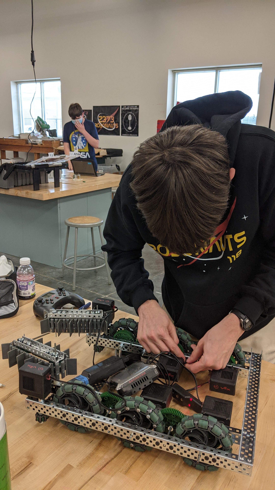
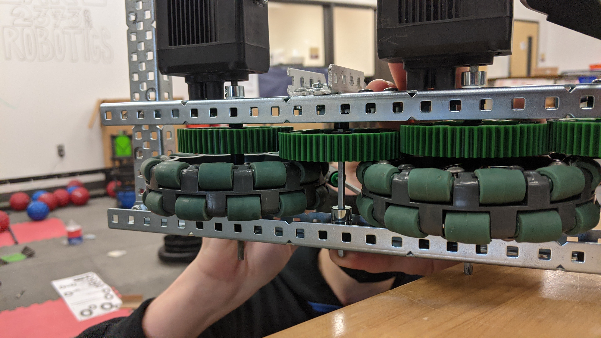

# Daily Report: 10/28/20

Attendees: Alexander, Ian

## Drivebase Code

This meeting, I wrote some code for the robot's drivebase to make it drive with the controller during the driver control period of the match. The code below makes our six wheel, four motor drivebase move with _split arcade_ style controls. It also makes the intake spin inwards (to intake a ball) when the `A` button is pressed, backward when the `B` button is pressed, and stop when neither are pressed. The code is within the `usercontrol` function, meaning it will be run when the competition enter the driver control mode.

```c++
int8_t intakeSpeed = 0;
int8_t drivebaseX = 0;
int8_t drivebaseY = 0;
while (true)
{
    drivebaseX = Primary.get_analog(pros::E_CONTROLLER_ANALOG_RIGHT_X);
    drivebaseY = Primary.get_analog(pros::E_CONTROLLER_ANALOG_LEFT_Y);
    LF = drivebaseY + drivebaseX;
    LB = drivebaseY + drivebaseX;
    RF = drivebaseY - drivebaseX;
    RB = drivebaseY - drivebaseX;

    intakeSpeed = Primary.get_digital(pros::E_CONTROLLER_DIGITAL_A) ? 127 : Primary.get_digital(pros::E_CONTROLLER_DIGITAL_B) ? -127 : 0;
    LI = intakeSpeed;
    RI = intakeSpeed;

    pros::delay(20);
}
```

The first three lines of the code initialize variables to store the intake's speed, the X position of the controller joystick to control the drivebase's turning, and the Y position of the controller joystick to control the drivebase's forward/backward turning.  
The next line, `while (true)`, creates a loop where everything in the lines between the open and closed braces are repeated forever, because `true` is always true! I refer to this loop as the main loop, since all of the robot's functionalities are executed inside this loop.  
I chose to initialize the variables for the drivebase control and intake speed in the first three lines and not inside the while loop, because I don't want a new variable to be created every time the loop runs (which is several million times a second).  
The first two lines inside the main loop set the `drivebaseX` and `drivebaseY` variables to the values of the analog sticks that control the turn and forward/backward motion on the controller.  
The next four lines set the velocities of the drivebase motors:

At the top of the file, the drivebase motors are initialized and stored in variables like so:

```c++
pros::Motor LF(15, false);
pros::Motor LB(14, false);
pros::Motor RF(16, true);
pros::Motor RB(17, true);
```

Each of these lines calls the constructor of the PROS motor class and creates a new motor named "LF", "RF", etc., which are abbreviations for the Left-Front, Right-Front, etc. motors. The code then passes parameters to the constructors inside the parentheses to tell the constructor which port the motor will be in and whether it should be reversed or not.

```c++
LF = drivebaseY + drivebaseX;
LB = drivebaseY + drivebaseX;
RF = drivebaseY - drivebaseX;
RB = drivebaseY - drivebaseX;
```

In the next four lines of the main loop (above), the motor velocities are set. The motor velocity is a range from -127 to +127, since that is the range of values that can be stored in an 8-bit signed integer. The velocities for each motor can be calculated from the horizontal and vertical axes to form a vector.

| Side  | Turn Right | Drive Forward |
| ----- | ---------- | ------------- |
| Left  | Positive   | Positive      |
| Right | Negative   | Positive      |

Since a positive value is returned when the joystick is moved to the right, right will be the positive side of the x axis, and since the joystick returns a positive value when moved forward, forward will be the positive side of the y axis. Since the robot drives right when the joystick is pushed right, the right side has to be move backward when the robot turns right, and the left side has to move forward, the value of the x axis has to have its sign flipped for the right side motors, then be added to the y axis to allow the robot to move forward when the joystick is moved forward.

```c++
intakeSpeed = Primary.get_digital(pros::E_CONTROLLER_DIGITAL_A) ? 127 : Primary.get_digital(pros::E_CONTROLLER_DIGITAL_B) ? -127 : 0;
```

The line above sets the speed of the intake to either full speed forward if the `A` button is pressed, full backward if the `B` button is pressed, or zero if neither is pressed. It utilizes the C++ ternary operator, which is essentially an `if` statement in one line. It asks "Is button A pressed?", and if it receves a true value, it will set the variable `intakeSpeed` to full speed forward. Otherwise, it would continue and ask "Is button B pressed?" If it is true, then the speed is full speed backwards, otherwise it is zero.  
In the next two lines of the main loop,

```c++
LI = intakeSpeed;
RI = intakeSpeed;
```

it merely sets the speed of the intake to said variable.

Finally there is `pros::delay(20);`. This pauses the loop for 20 milliseconds and allows the processor to switch to other tasks and execute them before returning to the main loop.

### Program Icons

One fun thing that I found on the VEX Forum today is a [way to select an icon for programs on the VEX Brain](https://www.vexforum.com/t/a-guide-to-changing-program-icons/78293). The post lists the icon files already on the Brain and the file names associated with the icons, so I can pick an icon that I like for my program. Then all I have to to is add the `--icon "icon_file.bmp"` flag to my upload command with the name of a file in the list, and it will set the icon for the program to the specified file.

## Vertical Bars

With our drivebase complete, we had to start building up. The first step was finding a way to screw on some 2x25 C-Channels to the insides of the robot. Each pair of C-Channels will have rubber band style rollers between them to act as an elevator for the Balls to get them to the top of the robot. In order to leave enough space between the bars and still be able to mount them to the robot, we had to align the bars with our drivebase gears. In order to mount the C-Channels, the gears needed to be unscrewed and removed, which took us a while.  

